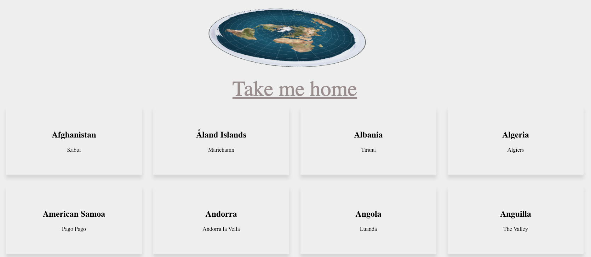
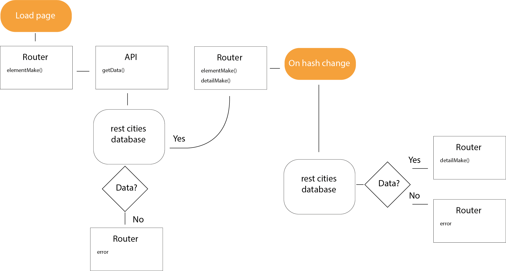

# Round Earth viewer
My repository for web app from scratch

In the three weeks this course lasted I was tasked to make a web app from scratch using only vanilla JavaScript.


## My App
My App displays all countries and independent states in the world (currently 250 countries total) and allows you to view a few details/some information about them. To do this the app uses the api [restcountries](https://restcountries.eu/).
More specifically the app makes an api call once the page is loaded and displays all countries onze the data has been collected. The user then has the option to click on any one country which will trigger a second api call which displays more information about that specific country. 
  
  It looks like this.
  
    
  
 
 
## Features
  * Overview page with countries
  * Detailpages with more info for each country
  * Routing with [Routie](http://projects.jga.me/routie/)
  * Templating with [transparency](https://github.com/leonidas/transparency)
  * Loading states
 
 
## API 

  I'm using the [restcountries](https://restcountries.eu/) API.
  I haven't come across any restrictions in my use case, the only problem i found was routing to each country's capital however it wasn't limiting rather a case of understanding.
  
  I collect the data asynchronously with a promise
  ```javascript
  getData: function(url) {
    return new Promise(function(resolve, reject) {
      const request = new XMLHttpRequest();
      request.open('GET', url, true)
      request.onload = () => {
        if (request.status >= 200 && request.status < 400) {
          const data = api.parse(request);
          const slicedData = data.slice(0, 250);
          resolve(slicedData);
        } else {
          reject(request.status);
        }
      };
      request.onerror = () => {
        reject(request.status); // error handling
      };
      request.send();
    });
  },
  parse: function(request) {
    return JSON.parse(request.responseText);
  }
  ```

## Actor diagram

  


## Interaction diagram

  The interaction flow of the app is described in the following diagram.




## Best practices I've applied
   * I've used object literals to structure my code
   * I don't use global variables
   * Use Strict
   * Use camelCase and clear descriptive English names
   * Neatly indented code
   * Variables are declared at the top of each scope
   
## Libraries
[Transparency templating engine](https://github.com/leonidas/transparency)  
[Routie](http://projects.jga.me/routie/)

## Feature wishlist 
  * I'd like to attempt to link a second API (sunset API) which can show what time the sun sets and rises for each county depending on the longtitude and latitude coordinates.
  * I had tried to implement a local storage to reduce the number of api calls however I found it rather difficult.
  * A filter option so the user can fill in a value in a search field and the app would filter the countries based on the input... so basically I'd like to make it possible for the user to search.
