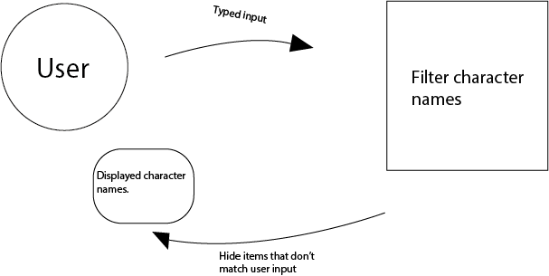

# Week 1 - Hello API 🐒

Doel: Data ophalen uit een API en renderen in een overzichtspagina.
  Mijn script weergeeft 10 hoofdpersonages van Star Wars. De gebruiker heeft de mogelijkheid om een de personages te filteren   op naam. Ik vergelijk de gebruikers input met de namen van de gebruikers en return de characters die overeenkomen.
  
Welke actoren zitten er in jouw applicatie? (actor diagram)
Welke API wordt gebruikt en wat zijn de beperkingen? (rate limit)

  De API die ik gebruik is 'https://swapi.co/api/people'
  De enige beperking is de data die de API terug geeft, het geeft slechts tekst en ik zou er plaatjes in willen verwerken.

Hoe flowed interactie door de applicatie? (interaction diagram)

  De interactie flow is instant en makkelijk te begijpen...

Welke design patterns en best practices
  Ik heb het erg simpel gehouden en weergeef de informatie op een makkelijke manier.

Wat zou je nog willen toevoegen (feature wishlist / backlog)
  Images en de mogelijkheid om door te clicken in de individuele character pagina.

[Opdrachten](https://drive.google.com/open?id=1OVhWQNaCgSluYviTKKWcApkyPd23xow1PiExb8GYANM)

[Slides](https://drive.google.com/open?id=1Rjl9xqXoKniQSRJPdkU1O5YwWC33SJK8KiV0a-H_xZU)

link naar repo
https://timilof.github.io/week1/
