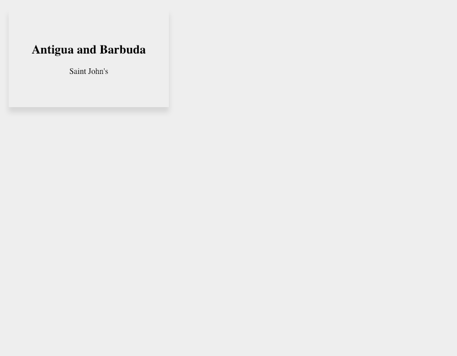
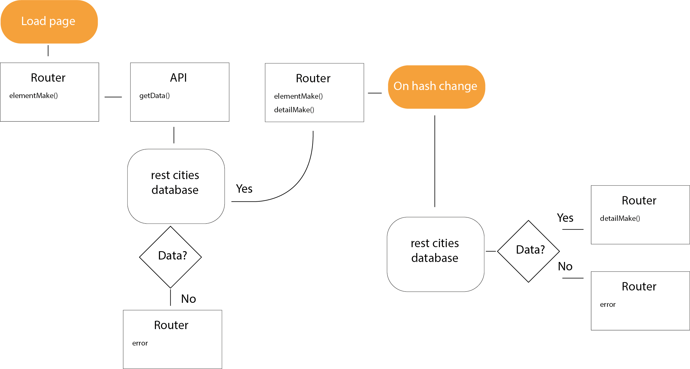

## Hello API 🐒

## use city-refactored.js

### What does this app do
My script fetches data from an API and displays 10 countries with capitals. The user can view the countries and capitals and see the latitude and lontitude of each country seperately.
  
  It looks like this.
    
  
### Welke actoren zitten er in jouw applicatie? (actor diagram)
There is a user and the API server
  
  
### Welke API wordt gebruikt en wat zijn de beperkingen? (rate limit)
  The API I'm using is 'https://restcountries.eu/'
  The only limitations to this API is the way the data is arranged (all 180 countries have been devided across three large objects).

### Hoe flowed interactie door de applicatie? (interaction diagram)

  The interaction flow is instant and easy to understand.

### Welke design patterns en best practices
  I've kept it very simple and load data prior to any user choices so as to assure a speedy feel to the app.

### Wat zou je nog willen toevoegen (feature wishlist / backlog)
  I'd like to add images of each countries respective flag and I'd like to attempt to link a second API (sunset API) which can request data the first API.

